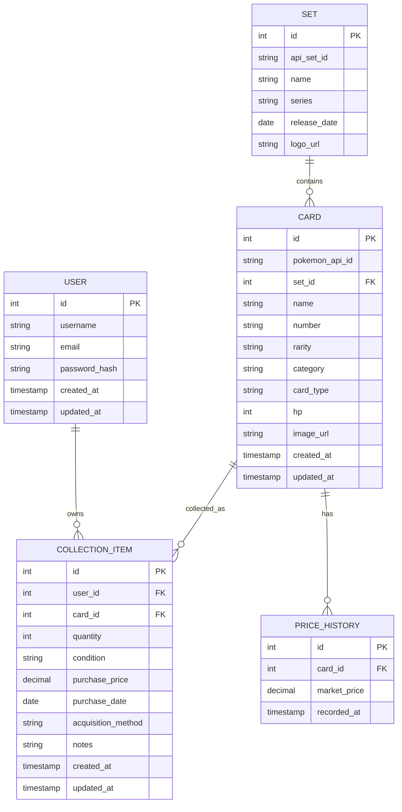

# Pokémon TCG Analyzer - Database Schema

## 1. Database Overview

Pokémon TCG Analyzer uses PostgreSQL as the primary database system.

The database is resiponsible for storing and managing application data, including:

- User account information
- Pokémon card metadata
- Card set information
- User collection records
- Historical card price data

The database design follows a relational model to ensure data consistency, scalability, and future extensibility.

The system separates external Pokémon card data from user-generated collection data.

Card information is managed as shared data, while collection records belong to individual users.

## 2. Design Principles

### 2.1 Hybrid Collection Model

The system adopts a Hybrid Collection Model to balance MVP simplicity and future extensibility.

For the MVP version, CollectionItem represents a user's ownership record of a specific card, including information such as quantity, condition, acquisition method, and purchase price.

Card metadata is stored separately as shared data and is not duplicated in individual collections.

The design leaves extension space for future features, such as individual card tracking, grading information, trading history, and ownership records.

### 2.2 Separation of Card Data and User Data

Card data stores shared Pokémon TCG information, including card name, HP, set, rarity, type, and image information. This data represents the definition and metadata of each card.

User-specific collection data is stored separately in CollectionItem. Instead of duplicating card information, CollectionItem references Card through a foreign key relationship and stores ownership-related information, such as quantity, purchase price, acquisition method, and condition.

This separation improves data consistency and avoids redundant storage when multiple users collect the same card.

### 2.3 External Data Synchronization

The system uses external Pokémon TCG data sources as the reference for card information.

Instead of querying external APIs for every user request, Pokémon card data is synchronized and stored in the local PostgreSQL database.

This approach improves response time, reduces dependency on external services, and provides more stable application performance.

Card metadata and market price data will be synchronized separately based on their update frequency.

Future versions may introduce a dedicated synchronization service to handle automated data updates, error handling, and external API changes.


### 2.4 Future Extensibility

The database design is structured to support future feature expansion without major architectural changes.

The current MVP focuses on core collection management while reserving extension points for future capabilities, such as individual card tracking, pack opening analysis, trading records, and AI-powered insights.

Future versions may introduce additional services and entities to support these features while maintaining compatibility with the existing system.

## 3. Entity Relationship Diagram

### 3.1 Relationship Overview

The database consists of five core entities:

- User
- Card
- Set
- CollectionItem
- PriceHistory

The relationships between entities are designed to separate shared card information from user-specific collection data.

A User can own multiple CollectionItems, and each CollectionItem references one Card.

A Card can appear in multiple users' collections and belongs to one Set.

A Card can have multiple PriceHistory records for market tracking.

A Card belongs to one Set and can have multiple PriceHistory records for market tracking.

### 3.2 Mermaid ER Diagram



                        +----------------+
                        |      User      |
                        +----------------+
                        | id             |
                        | username       |
                        | email          |
                        | password_hash  |
                        | created_at     |
                        +--------+-------+
                                 |
                                 |
                                 | 1
                                 |
                                 | N
                  +--------------v---------------+
                  |       CollectionItem         |
                  +------------------------------+
                  | id                           |
                  | user_id (FK)                 |
                  | card_id (FK)                 |
                  | quantity                     |
                  | condition                    |
                  | purchase_price               |
                  | purchase_date                |
                  | acquisition_method           |
                  | created_at                   |
                  +--------------+---------------+
                                 |
                                 |
                                 |
                                 |
                  +--------------v---------------+
                  |            Card              |
                  +------------------------------+
                  | id                           |
                  | pokemon_api_id               |
                  | set_id (FK)                  |
                  | name                         |
                  | number                       |
                  | rarity                       |
                  | type                         |
                  | hp                           |
                  | image_url                    |
                  +--------------+---------------+
                                 |
               +-----------------+-----------------+
               |                                   |
               |                                   |
               |                                   |
      +--------v--------+               +----------v-----------+
      |      Set        |               |    PriceHistory      |
      +-----------------+               +----------------------+
      | id              |               | id                   |
      | api_set_id      |               | card_id (FK)         |
      | name            |               | market_price         |
      | series          |               | updated_at           |
      | release_date    |               +----------------------+
      +-----------------+


## 4. Entity Design

### 4.1 User

#### Purpose

The User entity stores authentication information and identifies each registered user of the application.

Each user owns an independent card collection and can access personalized collection statistics and analysis.

#### Fields

| Field | Description |
|---------|-------------|
| id | Primary key |
| username | Public username displayed within the application |
| email | User login email (unique) |
| password_hash | Encrypted user password |
| created_at | Account creation timestamp |
| updated_at | Last profile update timestamp |

#### Design Notes

User authentication is implemented using JWT.

The username is stored separately from the email to support future community features, such as public collection sharing, trading, and user profiles.

Passwords are never stored in plain text and are always saved as password hashes.

### 4.2 Card

#### Purpose

The Card entity stores shared Pokémon TCG card metadata used throughout the application.

Instead of querying external APIs for every request, card information is synchronized into the local database and serves as the primary data source for searching, collection management, analytics, and future AI-powered features.

#### Fields

| Field | Description |
|---------|-------------|
| id | Primary key |
| pokemon_api_id | Original identifier from the Pokémon TCG API |
| set_id | Foreign key referencing the card's set |
| name | Card name |
| number | Card number within the set |
| rarity | Card rarity |
| category | Card category (Pokémon, Supporter, Item, Stadium, Energy, etc.) |
| card_type | Pokémon or Energy type (Fire, Water, Grass, etc.) |
| hp | Pokémon HP (nullable for non-Pokémon cards) |
| artist | Card illustrator |
| image_url | URL of the card image |
| created_at | Record creation timestamp |
| updated_at | Last synchronization timestamp |

#### Design Notes

The Card entity contains only shared Pokémon TCG metadata and does not store any user-specific ownership information.

User collections reference cards through foreign keys, preventing duplicated storage when multiple users own the same card.

The `pokemon_api_id` field preserves the relationship between local records and the external Pokémon TCG API, enabling future synchronization and metadata updates.

The `category` field represents the functional role of a card (such as Pokémon, Supporter, Item, Stadium, or Energy), while `card_type` represents the Pokémon or Energy attribute (such as Fire or Water). These fields describe different aspects of a card and are intentionally stored separately.

Some attributes, such as `hp`, are optional because they apply only to Pokémon cards.

The `artist` field is included as stable card metadata to support future search capabilities, collection statistics, and AI-powered recommendations.

Future versions may introduce additional metadata fields while maintaining compatibility with the existing database schema.

### 4.3 Set

#### Purpose

The Set entity stores Pokémon TCG expansion set information.

Each card belongs to one specific set, and set data provides grouping information for card search, collection analysis, and market statistics.

The Set entity represents shared expansion metadata synchronized from the external Pokémon TCG API.

#### Fields

| Field | Description |
|---------|-------------|
| id | Primary key |
| api_set_id | Original identifier from the Pokémon TCG API |
| name | Set name |
| series | Series that the set belongs to |
| release_date | Official release date of the set |
| logo_url | URL of the set logo image |
| created_at | Record creation timestamp |
| updated_at | Last synchronization timestamp |

#### Design Notes

The Set entity is separated from Card to avoid duplicated storage of set information.

Instead of storing set names and release information in every Card record, cards reference their corresponding Set through a foreign key relationship.

This design allows the system to perform set-level analysis efficiently, such as collection distribution, set popularity analysis, and future market trend analysis.

The `api_set_id` field maintains the connection between local database records and the external Pokémon TCG API, enabling future synchronization.

### 4.4 CollectionItem

#### Purpose

The CollectionItem entity represents the relationship between a user and their owned Pokémon cards.

It stores user-specific ownership information while referencing shared card metadata from the Card entity.

The MVP version adopts a Hybrid Collection Model, where one CollectionItem record can represent multiple copies of the same card while maintaining essential ownership information.

This design provides a simple collection management experience while leaving extension points for future individual card tracking features.

#### Fields

| Field | Description |
|---------|-------------|
| id | Primary key |
| user_id | Foreign key referencing the owner |
| card_id | Foreign key referencing the collected card |
| quantity | Number of copies owned |
| condition | Physical condition of the cards |
| purchase_price | Acquisition price paid by the user |
| purchase_date | Date when the cards were acquired |
| acquisition_method | How the card was obtained (purchase, pull, trade, etc.) |
| notes | Additional user notes |
| created_at | Record creation timestamp |
| updated_at | Last modification timestamp |

#### Design Notes

CollectionItem stores ownership-related information and does not duplicate card metadata.

Card information such as name, rarity, set, and type is retrieved through the relationship with the Card entity.

The current Hybrid Collection Model simplifies MVP implementation by grouping identical cards together using the quantity field.

Future versions may introduce a CardInstance entity to track individual cards with additional attributes, such as grading information, unique ownership history, trading records, or specific acquisition sources.

Purchase information is stored at the collection level because the MVP focuses on collection valuation and management rather than detailed transaction tracking.

### 4.5 PriceHistory

#### Purpose

The PriceHistory entity stores historical market price records for Pokémon cards.

Instead of storing only the current market price in the Card entity, the system maintains multiple historical price records to support price tracking, market analysis, and collection value changes over time.

Each PriceHistory record represents the market value of a card at a specific point in time.

#### Fields

| Field | Description |
|---------|-------------|
| id | Primary key |
| card_id | Foreign key referencing the associated card |
| market_price | Recorded market price of the card |
| recorded_at | Timestamp when the price was recorded |

#### Design Notes

PriceHistory is separated from the Card entity because market prices are dynamic data rather than static card metadata.

A card may have multiple price records over time, allowing the system to analyze price trends and calculate historical collection value changes.

The latest PriceHistory record can be used as the current market price without storing duplicate price information in the Card table.

Future versions may introduce additional fields such as price source, marketplace information, and automated synchronization status to support multiple pricing providers.

## 5. Relationships
### 5.1 User - CollectionItem

#### Relationship

One User can have multiple CollectionItems.

Each CollectionItem belongs to exactly one User.

Relationship:

```
User (1) -------- (N) CollectionItem
```

#### Design Notes

The relationship allows each user to maintain an independent Pokémon card collection.

CollectionItem stores user-specific ownership information while User stores only account-related information.

This separation prevents users from sharing or modifying each other's collection data.

### 5.2 Card - CollectionItem

#### Relationship

One Card can be referenced by multiple CollectionItems.

Each CollectionItem references one Card.

Relationship:

```
Card (1) -------- (N) CollectionItem
```

#### Design Notes

Card represents shared Pokémon TCG metadata, while CollectionItem represents user ownership information.

Multiple users can own the same card without duplicating card metadata.

For example, thousands of users may own the same Charizard card, but only one Card record is stored.

### 5.3 Set - Card

#### Relationship

One Set contains multiple Cards.

Each Card belongs to one Set.

Relationship:

```
Set (1) -------- (N) Card
```

#### Design Notes

Set information is separated from Card information to avoid repeating expansion metadata across thousands of card records.

This relationship enables set-level analytics, such as collection distribution by expansion and market analysis by set.

### 5.4 Card - PriceHistory

#### Relationship

One Card can have multiple PriceHistory records.

Each PriceHistory record belongs to one Card.

Relationship:

```
Card (1) -------- (N) PriceHistory
```

#### Design Notes

A card's market price changes over time, so historical price records are stored separately from static card metadata.

This design allows the system to track price trends, calculate collection value changes, and support future market analysis features.

### 5.5 Referential Integrity

Foreign key constraints are used to maintain consistency between related entities.

Examples:

- CollectionItem.user_id must reference an existing User.
- CollectionItem.card_id must reference an existing Card.
- Card.set_id must reference an existing Set.
- PriceHistory.card_id must reference an existing Card.

Deletion behavior should be carefully controlled to prevent accidental loss of related data.

For example, deleting a User may remove associated CollectionItems, while deleting a Card should be restricted if existing collection records reference it.

## 6. Futrue Expansion

## 6. Future Expansion

The current database schema is designed for MVP functionality while maintaining flexibility for future feature expansion.

The following improvements may be introduced in future versions.

---

### 6.1 Individual Card Tracking

#### Current Limitation

The MVP uses the Hybrid Collection Model, where multiple copies of the same card are represented using the quantity field in CollectionItem.

This approach simplifies collection management but does not track individual physical cards.

#### Future Design

A new CardInstance entity may be introduced to represent individual physical cards.

Possible attributes include:

- card_id
- owner_id
- condition
- grading_company
- grade
- certification_number
- acquisition_history

This would support advanced collection features such as PSA grading tracking, trading history, and individual card valuation.

---

### 6.2 Pack Opening and Acquisition Tracking

#### Current Limitation

The MVP records acquisition information through CollectionItem fields such as purchase_price and acquisition_method.

Detailed pack opening history is not currently modeled.

#### Future Design

A PackOpening system may be introduced to track:

- purchased products
- pack cost
- opening date
- opened packs
- pulled cards

Possible structure:

```
Pack
 |
 |
PackOpening
 |
 |
PulledCard
 |
 |
CollectionItem
```

This would enable features such as:

- Pack Expected Value (EV) calculation
- Pull rate analysis
- Cost-per-card analysis
- Personal opening statistics

---

### 6.3 Multiple Price Sources

#### Current Limitation

The MVP focuses on a single market price source.

#### Future Design

PriceHistory may be extended with additional fields:

- price_source
- marketplace
- currency

This would allow comparison between different marketplaces and improve market analysis accuracy.

---

### 6.4 AI-powered Recommendation System

#### Current Limitation

The MVP does not include AI-generated insights.

#### Future Design

Additional data pipelines may be introduced to support AI features.

Potential capabilities include:

- Collection analysis
- Card recommendations
- Budget-based purchasing suggestions
- Natural language queries
- Card image recognition

AI services may interact with existing entities such as:

- Card
- CollectionItem
- PriceHistory
- Set

without requiring major changes to the core schema.

---

### 6.5 Analytics and Historical Data

Future versions may introduce additional analytical data models to support:

- Collection value history
- Investment performance
- Market trend prediction
- User collecting patterns

These features can be implemented through additional analytical tables or data processing pipelines while preserving the existing transactional database design.